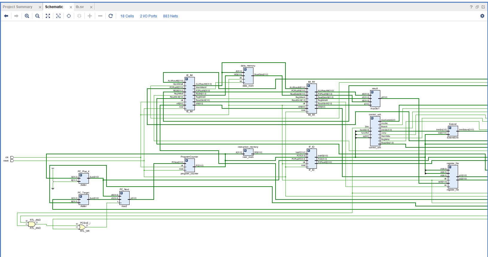
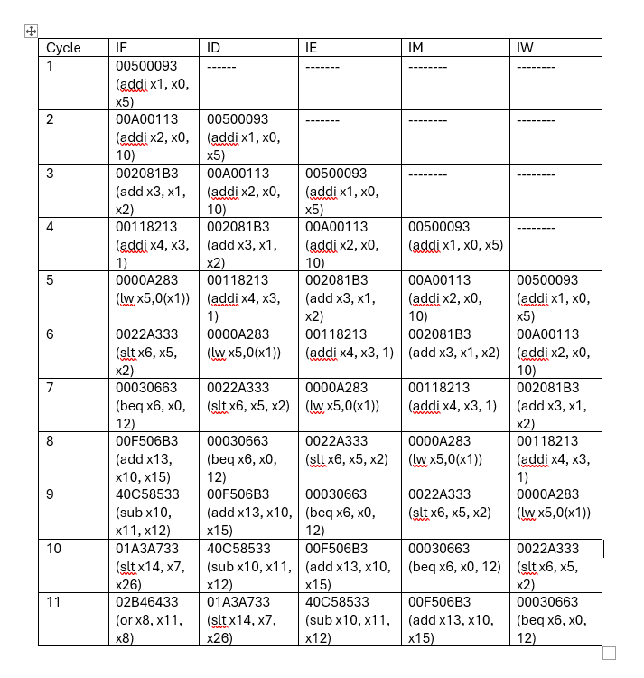

## ✅ Paste this **full README.md** into your repository

```markdown
# 🧠 5‑Stage Pipelined RISC‑V Processor (RV32I)


*Overall architecture of the 5‑stage pipelined RISC‑V processor.*

[](https://github.com/waynaali/5-Stage-Pipelined-RISC-V-Processor/stargazers)
[](./LICENSE)

This repository implements a **5‑stage pipelined RISC‑V (RV32I)** processor in **SystemVerilog** with standard pipeline registers between every stage to increase instruction throughput compared to a single‑cycle design. Pipelining allows instructions to overlap in execution, improving performance.

---

## 🚀 Pipeline Overview

The processor breaks instruction execution into *five stages*, each done by dedicated logic with intermediate registers.

---

### 🔁 Pipeline Stages

| Stage | Description |
|-------|-------------|
| **IF**  | Instruction Fetch — fetches instruction from instruction memory |
| **ID**  | Instruction Decode — decodes instruction, reads registers |
| **EX**  | Execute — ALU operations and address calculation |
| **MEM** | Memory Access — load/store data memory |
| **WB**  | Write Back — writes results back to register file |

---

## 🧩 Pipeline Diagram

Below is a visual representation of how instructions flow through the pipeline:


*Pipeline schematic and register connections.*

---

## 📊 Waveforms

Here is a typical simulation showing multiple instructions progressing through the pipeline:

.png)
*Example waveform showing IF, ID, EX, MEM, WB stages in simulation.*

---

## 📁 Folder Structure

```

5‑Stage‑Pipelined‑RISC‑V‑Processor/
│
├── doc/                  # Block diagrams, waveforms, verification visuals
├── srcs/                 # SystemVerilog source files
├── tb/                   # Testbench files for simulation
├── README.md             # This documentation
└── LICENSE               # License information

````

---

## 🛠️ How to Simulate

1. Clone the repository:

    ```bash
    git clone https://github.com/waynaali/5-Stage-Pipelined-RISC-V-Processor.git
    cd 5-Stage-Pipelined-RISC-V-Processor
    ```

2. Compile & simulate (example ModelSim/Questa):

    ```bash
    vlog srcs/*.sv tb/*.sv
    vsim tb
    run -all
    ```

---

## 📜 License

This project is licensed under the **MIT License** — see `LICENSE` for details.

---

## 🙌 About

**Wayna Ali** — SystemVerilog implementation of a 5‑stage pipelined RISC‑V processor.

GitHub: https://github.com/waynaali/5-Stage-Pipelined-RISC-V-Processor
